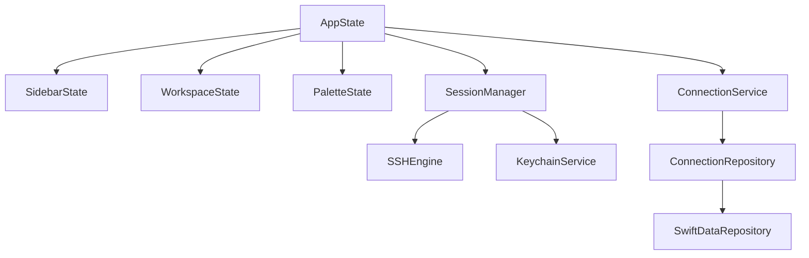
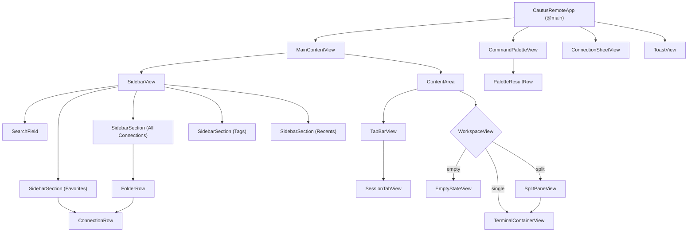
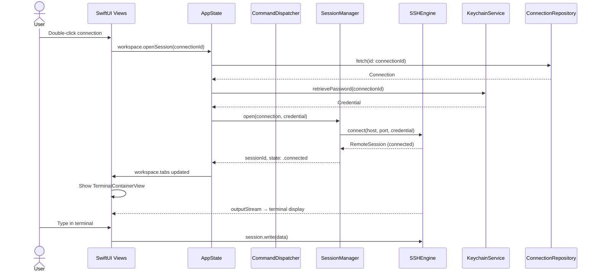
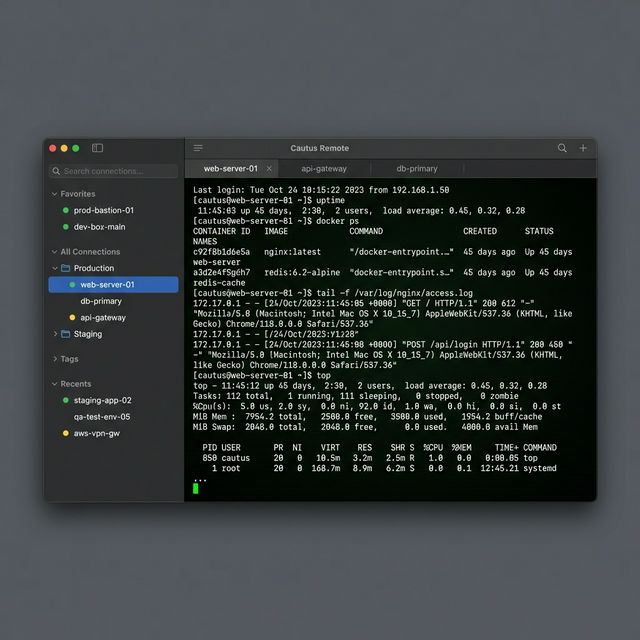
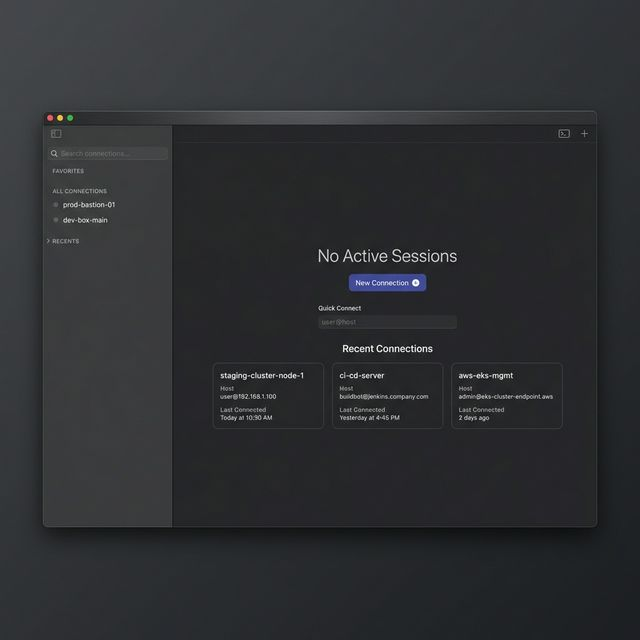
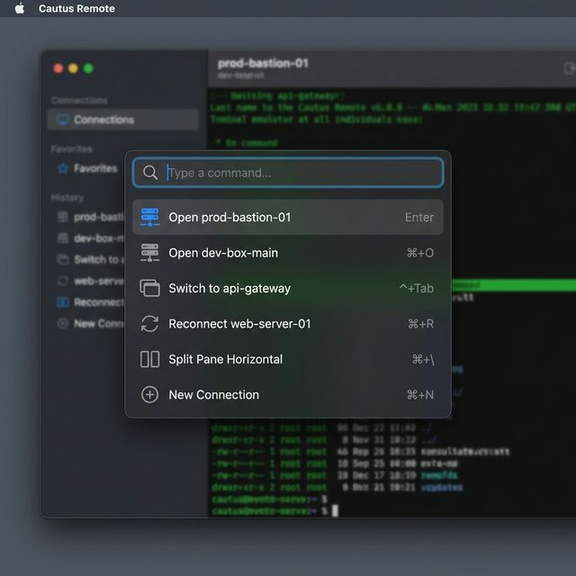

# Cautus Remote — Detailed Design

**Version:** 1.0
**Date:** 2026-02-21

---

## 1. Project Structure (SPM)

```
remotus/
├── Package.swift
├── Sources/
│   └── CautusRemote/
│       ├── App/
│       │   ├── CautusRemoteApp.swift          # @main entry point
│       │   ├── AppDelegate.swift              # NSApplicationDelegate for AppKit lifecycle
│       │   └── WindowController.swift         # NSWindowController (min size, tab config)
│       │
│       ├── Models/
│       │   ├── Connection.swift               # @Model — SSH connection entity
│       │   ├── Folder.swift                   # @Model — hierarchical folder
│       │   ├── Tag.swift                      # @Model — flexible label
│       │   ├── AuthMethod.swift               # Enum: .password, .publicKey
│       │   └── SessionState.swift             # Enum: connecting, connected, etc.
│       │
│       ├── Protocols/
│       │   ├── RemoteProtocol.swift           # Protocol abstraction for SSH/VNC/RDP
│       │   ├── RemoteSession.swift            # Active session handle
│       │   └── ConnectionRepository.swift     # Persistence abstraction
│       │
│       ├── Services/
│       │   ├── SSHEngine.swift                # SwiftNIO SSH implementation
│       │   ├── SessionManager.swift           # Session lifecycle orchestrator
│       │   ├── ConnectionService.swift        # CRUD via ConnectionRepository
│       │   ├── CommandDispatcher.swift         # Command palette routing
│       │   └── KeychainService.swift          # Raw Security.framework wrapper
│       │
│       ├── Persistence/
│       │   └── SwiftDataRepository.swift      # ConnectionRepository → SwiftData
│       │
│       ├── State/
│       │   ├── AppState.swift                 # Root @Observable state container
│       │   ├── SidebarState.swift             # Sidebar selection, search, section collapse
│       │   ├── WorkspaceState.swift           # Active tabs, split tree, focus
│       │   └── PaletteState.swift             # Command palette query & results
│       │
│       ├── Views/
│       │   ├── MainContentView.swift          # Top-level NavigationSplitView
│       │   ├── Sidebar/
│       │   │   ├── SidebarView.swift          # Full sidebar with sections
│       │   │   ├── SidebarSection.swift       # Collapsible section container
│       │   │   ├── ConnectionRow.swift        # Single connection row + status dot
│       │   │   └── FolderRow.swift            # Folder with disclosure
│       │   ├── Workspace/
│       │   │   ├── WorkspaceView.swift        # Routes empty/single/split
│       │   │   ├── EmptyStateView.swift       # "No Active Sessions"
│       │   │   ├── TerminalContainerView.swift # NSViewRepresentable → SwiftTerm
│       │   │   └── SplitPaneView.swift        # Recursive split tree
│       │   ├── TabBar/
│       │   │   ├── TabBarView.swift           # Session tab strip
│       │   │   └── SessionTabView.swift       # Individual tab + state indicator
│       │   ├── Palette/
│       │   │   ├── CommandPaletteView.swift   # Overlay panel (⌘K)
│       │   │   └── PaletteResultRow.swift     # Single search result
│       │   ├── Sheets/
│       │   │   └── ConnectionSheetView.swift  # Create/edit connection sheet
│       │   └── Components/
│       │       ├── StatusDot.swift            # 6-8px status indicator
│       │       └── ToastView.swift            # Non-blocking error banner
│       │
│       └── Utilities/
│           ├── Constants.swift                # Layout constants, timing
│           ├── KeyboardShortcuts.swift         # ⌘K, ⌘N, ⌘W bindings
│           └── FuzzySearch.swift              # Search ranking algorithm
│
├── Tests/
│   └── CautusRemoteTests/
│       ├── Models/
│       │   └── ConnectionTests.swift
│       ├── Services/
│       │   ├── SSHEngineTests.swift
│       │   ├── SessionManagerTests.swift
│       │   ├── KeychainServiceTests.swift
│       │   └── CommandDispatcherTests.swift
│       ├── Persistence/
│       │   └── SwiftDataRepositoryTests.swift
│       └── State/
│           ├── SplitPaneTests.swift
│           └── FuzzySearchTests.swift
│
├── Resources/
│   ├── Assets.xcassets/                       # App icon, accent color
│   ├── CautusRemote.entitlements              # Sandbox + Keychain + Network
│   └── Info.plist
│
├── Docker/
│   ├── Dockerfile.test-ssh                    # Alpine + openssh-server
│   └── docker-compose.yml                     # SSH + jump host containers
│
└── docs/
    ├── prd.md
    ├── architecture.md
    ├── ui-spec.md
    └── design.md (this file)
```

---

## 2. Domain Models

### 2.1 Connection

```swift
import SwiftData
import Foundation

enum AuthMethod: String, Codable, CaseIterable {
    case password
    case publicKey
}

@Model
final class Connection {
    @Attribute(.unique) var id: UUID
    var name: String
    var host: String
    var port: Int
    var username: String
    var authMethod: AuthMethod
    var sshKeyPath: String?       // filesystem path to key
    var jumpHostId: UUID?          // reference to another Connection
    var isFavorite: Bool
    var lastConnectedAt: Date?

    // Relationships
    var folder: Folder?
    @Relationship(inverse: \Tag.connections)
    var tags: [Tag]

    // Advanced settings
    var keepaliveInterval: Int     // seconds, default 60
    var connectionTimeout: Int     // seconds, default 30
    var terminalFontSize: Int?     // nil = use default
    var scrollbackLines: Int       // default 10000
    var environmentVars: [String: String]

    // Metadata
    var createdAt: Date
    var updatedAt: Date

    init(
        name: String,
        host: String,
        port: Int = 22,
        username: String,
        authMethod: AuthMethod = .password
    ) {
        self.id = UUID()
        self.name = name
        self.host = host
        self.port = port
        self.username = username
        self.authMethod = authMethod
        self.isFavorite = false
        self.tags = []
        self.keepaliveInterval = 60
        self.connectionTimeout = 30
        self.scrollbackLines = 10000
        self.environmentVars = [:]
        self.createdAt = .now
        self.updatedAt = .now
    }
}
```

### 2.2 Folder

```swift
@Model
final class Folder {
    @Attribute(.unique) var id: UUID
    var name: String
    var parentFolder: Folder?      // nil = root level

    @Relationship(inverse: \Connection.folder)
    var connections: [Connection]

    @Relationship(inverse: \Folder.parentFolder)
    var subfolders: [Folder]

    var sortOrder: Int
    var createdAt: Date

    init(name: String, parent: Folder? = nil) {
        self.id = UUID()
        self.name = name
        self.parentFolder = parent
        self.connections = []
        self.subfolders = []
        self.sortOrder = 0
        self.createdAt = .now
    }
}
```

### 2.3 Tag

```swift
@Model
final class Tag {
    @Attribute(.unique) var id: UUID
    var name: String
    var connections: [Connection]

    init(name: String) {
        self.id = UUID()
        self.name = name
        self.connections = []
    }
}
```

### 2.4 SessionState

```swift
enum SessionState: Equatable {
    case idle                          // not yet connected
    case connecting
    case connected
    case reconnecting(attempt: Int)    // which retry attempt
    case failed(SessionError)
    case disconnected

    var isActive: Bool {
        switch self {
        case .connecting, .connected, .reconnecting: return true
        default: return false
        }
    }

    var statusColor: StatusColor {
        switch self {
        case .connected: return .green
        case .reconnecting: return .yellow
        case .failed: return .red
        default: return .none
        }
    }
}

enum StatusColor {
    case green, yellow, red, none
}

struct SessionError: Error, Equatable {
    let code: ErrorCode
    let message: String

    enum ErrorCode: Equatable {
        case authFailed
        case timeout
        case hostUnreachable
        case connectionRefused
        case keyNotFound
        case unknown
    }
}
```

---

## 3. Protocol Abstractions

### 3.1 RemoteProtocol

```swift
/// Abstraction for any remote connection protocol (SSH, VNC, RDP, Telnet)
protocol RemoteProtocol: Sendable {
    /// Unique identifier for this protocol type
    var protocolName: String { get }

    /// Auth methods this protocol supports
    var supportedAuthMethods: [AuthMethod] { get }

    /// Establish a connection, returning an active session handle
    func connect(
        to connection: Connection,
        credential: Credential
    ) async throws -> any RemoteSession

    /// Gracefully disconnect
    func disconnect(session: any RemoteSession) async
}
```

### 3.2 RemoteSession

```swift
/// Handle to an active remote session
protocol RemoteSession: AnyObject, Sendable {
    var id: UUID { get }
    var connectionId: UUID { get }
    var state: SessionState { get }

    /// Stream of state changes
    var statePublisher: AnyPublisher<SessionState, Never> { get }

    /// Write data to the remote (user input)
    func write(_ data: Data) async throws

    /// Stream of data from the remote (terminal output)
    var outputStream: AsyncStream<Data> { get }

    /// Resize the PTY
    func resize(cols: Int, rows: Int) async throws

    /// Attempt reconnection
    func reconnect() async throws
}
```

### 3.3 Credential

```swift
/// Credential retrieved from Keychain — never persisted as plaintext
enum Credential {
    case password(String)
    case privateKey(path: String, passphrase: String?)
}
```

### 3.4 ConnectionRepository

```swift
/// Persistence abstraction — v1 backed by SwiftData, swappable later
protocol ConnectionRepository: Sendable {
    // Connections
    func fetchAll() async throws -> [Connection]
    func fetch(id: UUID) async throws -> Connection?
    func save(_ connection: Connection) async throws
    func delete(_ connection: Connection) async throws
    func search(query: String) async throws -> [Connection]

    // Folders
    func fetchRootFolders() async throws -> [Folder]
    func save(_ folder: Folder) async throws
    func delete(_ folder: Folder) async throws

    // Tags
    func fetchAllTags() async throws -> [Tag]
    func save(_ tag: Tag) async throws

    // Recents
    func fetchRecents(limit: Int) async throws -> [Connection]

    // Favorites
    func fetchFavorites() async throws -> [Connection]
}
```

---

## 4. State Management

### 4.1 Architecture



### 4.2 AppState (Root)

```swift
@Observable
final class AppState {
    // Child state objects
    var sidebar = SidebarState()
    var workspace = WorkspaceState()
    var palette = PaletteState()

    // Services (injected)
    let sessionManager: SessionManager
    let connectionService: ConnectionService
    let keychainService: KeychainService

    // Global state
    var isShowingConnectionSheet = false
    var editingConnection: Connection?
    var toastMessage: ToastMessage?
}
```

### 4.3 SidebarState

```swift
@Observable
final class SidebarState {
    var searchQuery: String = ""
    var selectedConnectionId: UUID?
    var expandedSections: Set<SidebarSection> = [.favorites, .allConnections]
    var expandedFolderIds: Set<UUID> = []

    enum SidebarSection: Hashable {
        case favorites, allConnections, tags, recents
    }
}
```

### 4.4 WorkspaceState

```swift
@Observable
final class WorkspaceState {
    var tabs: [SessionTab] = []
    var activeTabId: UUID?
    var splitRoot: SplitNode?     // nil = single pane, non-nil = split layout

    var activeTab: SessionTab? {
        tabs.first { $0.id == activeTabId }
    }

    var isEmpty: Bool { tabs.isEmpty }
}

struct SessionTab: Identifiable {
    let id: UUID
    let connectionId: UUID
    let sessionId: UUID
    var title: String
    var state: SessionState
}
```

### 4.5 Split Pane Model

```swift
/// Recursive tree for split layout — max depth 2 (4 panes)
indirect enum SplitNode: Identifiable {
    case terminal(id: UUID, sessionId: UUID)
    case split(id: UUID, orientation: SplitOrientation, children: [SplitNode])

    var id: UUID {
        switch self {
        case .terminal(let id, _): return id
        case .split(let id, _, _): return id
        }
    }

    /// Count of terminal leaves
    var paneCount: Int {
        switch self {
        case .terminal: return 1
        case .split(_, _, let children):
            return children.reduce(0) { $0 + $1.paneCount }
        }
    }

    /// Max 4 panes enforced
    var canSplit: Bool { paneCount < 4 }
}

enum SplitOrientation {
    case horizontal  // side by side
    case vertical    // stacked
}
```

### 4.6 PaletteState

```swift
@Observable
final class PaletteState {
    var isVisible = false
    var query: String = ""
    var results: [PaletteResult] = []
    var selectedIndex: Int = 0

    struct PaletteResult: Identifiable {
        let id: UUID
        let title: String
        let subtitle: String?
        let icon: String         // SF Symbol name
        let action: PaletteAction
        let score: Double        // for ranking
    }
}

enum PaletteAction {
    case openConnection(UUID)
    case switchTab(UUID)
    case reconnect(UUID)
    case duplicateSession(UUID)
    case splitPane(SplitOrientation)
    case editConnection(UUID)
    case newConnection
    case closeTab(UUID)
}
```

---

## 5. Service Layer

### 5.1 SessionManager

```swift
@Observable
final class SessionManager {
    private(set) var sessions: [UUID: any RemoteSession] = [:]
    private let sshEngine: SSHEngine
    private let keychainService: KeychainService

    /// Open a new session for a connection
    func open(connection: Connection) async throws -> UUID

    /// Close a session
    func close(sessionId: UUID) async

    /// Reconnect a failed/disconnected session
    func reconnect(sessionId: UUID) async throws

    /// Get live state for a session
    func state(for sessionId: UUID) -> SessionState
}
```

### 5.2 KeychainService

```swift
/// Thin wrapper around Security.framework Keychain Services API
struct KeychainService: Sendable {
    /// Store a password for a connection
    func storePassword(_ password: String, for connectionId: UUID) throws

    /// Retrieve a password
    func retrievePassword(for connectionId: UUID) throws -> String?

    /// Delete a stored password
    func deletePassword(for connectionId: UUID) throws

    /// Store a key passphrase
    func storePassphrase(_ passphrase: String, for connectionId: UUID) throws

    /// Retrieve a key passphrase
    func retrievePassphrase(for connectionId: UUID) throws -> String?

    /// Delete all credentials for a connection
    func deleteAll(for connectionId: UUID) throws
}
```

### 5.3 CommandDispatcher

```swift
final class CommandDispatcher {
    private let appState: AppState

    /// Generate palette results for a query
    func search(query: String) -> [PaletteState.PaletteResult]

    /// Execute a palette action
    func dispatch(_ action: PaletteAction) async

    /// Ranking: exact > prefix > fuzzy, favorites & recents boosted
    private func rank(_ candidate: String, query: String, isFavorite: Bool, isRecent: Bool) -> Double
}
```

---

## 6. UI Component Hierarchy



### View → State Bindings

| View | Reads From | Writes To |
|------|-----------|-----------|
| `SidebarView` | `SidebarState`, `ConnectionService` | `SidebarState.selectedConnectionId` |
| `WorkspaceView` | `WorkspaceState` | — |
| `TabBarView` | `WorkspaceState.tabs` | `WorkspaceState.activeTabId` |
| `TerminalContainerView` | `RemoteSession.outputStream` | `RemoteSession.write()` |
| `SplitPaneView` | `WorkspaceState.splitRoot` | `WorkspaceState.splitRoot` |
| `CommandPaletteView` | `PaletteState` | `PaletteState.query`, dispatches actions |
| `ConnectionSheetView` | `AppState.editingConnection` | `ConnectionService.save()` |
| `StatusDot` | `SessionState.statusColor` | — |

---

## 7. Data Flow Diagram



---

## 8. AppKit / SwiftUI Bridging

### Where AppKit is Required

| Component | Why AppKit | Bridge Method |
|-----------|-----------|---------------|
| `WindowController` | Min size, tab config, window restoration | `NSWindowController` subclass |
| `TerminalContainerView` | SwiftTerm provides `TerminalView` (NSView) | `NSViewRepresentable` |
| `SplitPaneView` | NSSplitView for native drag dividers | `NSViewRepresentable` |
| `AppDelegate` | Application lifecycle, menu bar | `@NSApplicationDelegateAdaptor` |

### Everything Else: Pure SwiftUI

Sidebar, TabBar, CommandPalette, ConnectionSheet, EmptyState, StatusDot, Toast — all SwiftUI.

---

## 9. Keyboard Shortcut Routing

```swift
// In CautusRemoteApp.swift — menu bar commands
.commands {
    CommandGroup(replacing: .newItem) {
        Button("New Connection") { appState.isShowingConnectionSheet = true }
            .keyboardShortcut("n", modifiers: .command)
    }
    CommandMenu("Session") {
        Button("Command Palette") { appState.palette.isVisible.toggle() }
            .keyboardShortcut("k", modifiers: .command)
        Button("Close Tab") { appState.workspace.closeActiveTab() }
            .keyboardShortcut("w", modifiers: .command)
        Button("Previous Pane") { appState.workspace.focusPreviousPane() }
            .keyboardShortcut(.leftArrow, modifiers: [.command, .option])
        Button("Next Pane") { appState.workspace.focusNextPane() }
            .keyboardShortcut(.rightArrow, modifiers: [.command, .option])
    }
}
```

---

## 10. Entitlements & Sandbox

```xml
<!-- CautusRemote.entitlements -->
<dict>
    <key>com.apple.security.app-sandbox</key>        <true/>
    <key>com.apple.security.network.client</key>     <true/>   <!-- SSH outbound -->
    <key>com.apple.security.files.user-selected.read-only</key> <true/> <!-- SSH key files -->
    <key>keychain-access-groups</key>
    <array>
        <string>$(AppIdentifierPrefix)com.cautus.remote</string>
    </array>
</dict>
```

---

## 11. Layout Constants

```swift
enum Layout {
    // Window
    static let minWindowWidth: CGFloat = 1100
    static let minWindowHeight: CGFloat = 700

    // Sidebar
    static let sidebarDefaultWidth: CGFloat = 260
    static let sidebarMinWidth: CGFloat = 220
    static let sidebarMaxWidth: CGFloat = 360
    static let sidebarRowHeight: CGFloat = 30

    // Status Dot
    static let statusDotSize: CGFloat = 7

    // Spacing
    static let spacingSmall: CGFloat = 8
    static let spacingMedium: CGFloat = 16
    static let spacingLarge: CGFloat = 24

    // Animation
    static let animationDuration: Double = 0.15  // 150ms
}
```

---

## 12. UI Wireframes

### 12.1 Main Window — Active Session

Sidebar with hierarchical connections and status dots, tab bar with multiple sessions, full-bleed terminal.



### 12.2 Empty State

Calm, premium empty state with "No Active Sessions", Quick Connect field, and recent connection cards.



### 12.3 Command Palette (⌘K)

Centered overlay with fuzzy search, ranked results, and keyboard shortcut hints.


